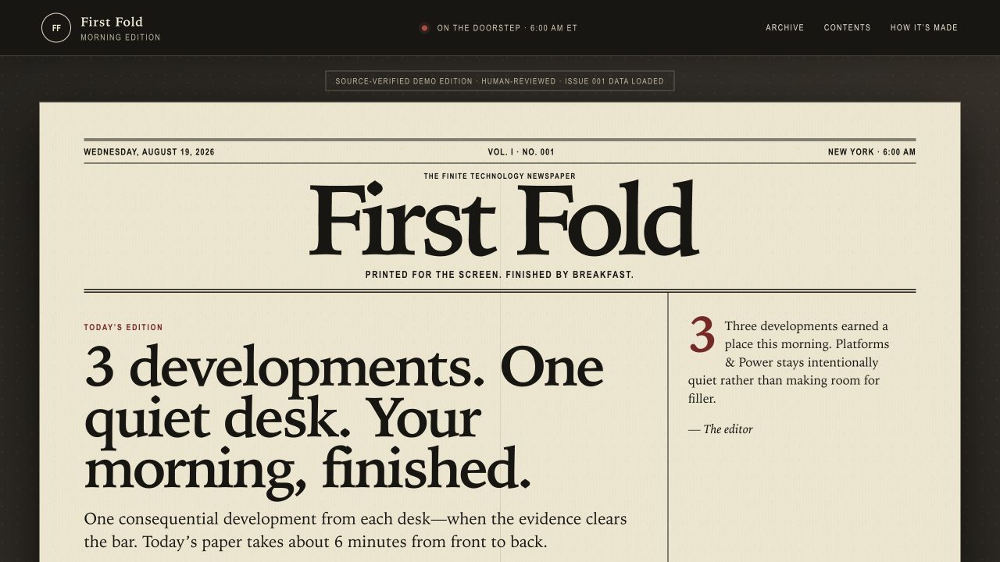
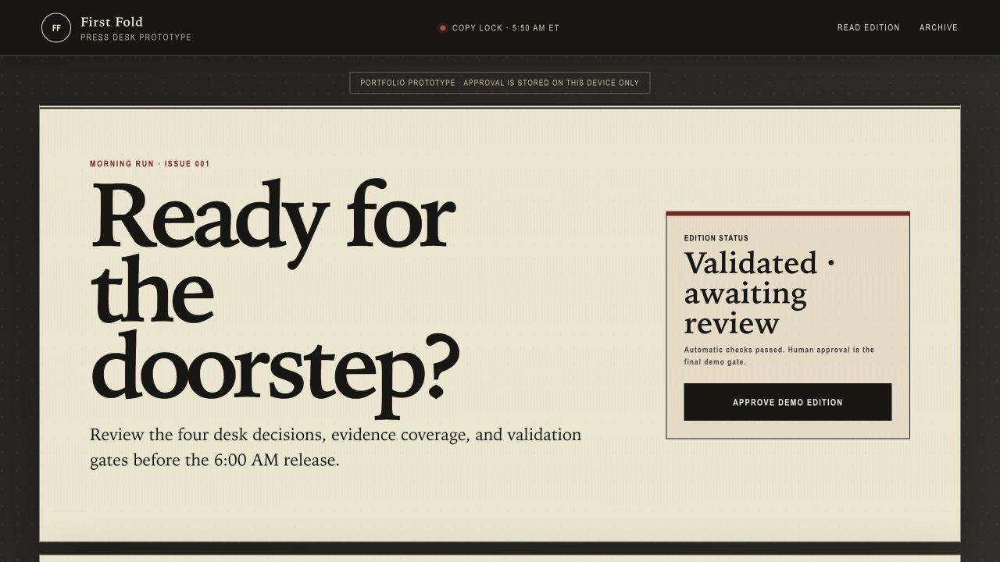
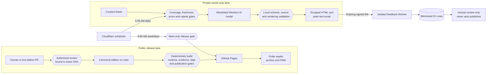

# First Fold

[](https://github.com/itworksinprod/first-fold/actions/workflows/ci.yml)

**A finite, six-minute technology newspaper built as a secure AI and cloud-automation pilot.**

[Read the live edition](https://itworksinprod.github.io/first-fold/) ·
[Open the review desk](https://itworksinprod.github.io/first-fold/editor/) ·
[See the architecture](#architecture) ·
[Run it locally](#run-the-mvp)



First Fold publishes at most one consequential story from each of four desks:
**AI & Models, Work & Tools, Security & Privacy, and Platforms & Power**. A weak
story leaves a desk intentionally quiet instead of becoming filler. The result
is an accessible, installable PWA with a dated archive and a clear stopping
point—not another infinite feed.

Behind the reader is a security-conscious delivery system: canonical JSON
editions, deterministic builds, schema and provenance validation, bounded
research, exact-revision human approval, least-privilege automation, and a
fail-closed 6:00 AM publication gate. Public pages contain no runtime feeds,
model credentials, or client-side AI calls.

## What this demonstrates

- **Secure CI/CD:** locked installs, automated tests, least-privilege workflow
  permissions, exact-revision approval, and deployment of the tested artifact.
- **Human-governed AI:** models may research and draft, but deterministic gates
  and an authorized reviewer control public publication.
- **Defense in depth:** allowlisted sources, bounded requests and retries,
  schema validation, evidence checks, repeat suppression, and fail-closed output.
- **Privacy-preserving separation:** private candidates remain ephemeral and
  never enter public branches, Pages deployments, or reusable content artifacts.
- **End-to-end product engineering:** responsive reading, keyboard and touch
  navigation, reduced-motion support, offline labeling, archives, and PWA install.

## Human review desk



## Architecture



The [review desk](https://itworksinprod.github.io/first-fold/editor/) exposes
the same revision-bound reader projection used by the public edition. It is a
portfolio prototype, not a production administration surface.

## Why this exists

Most news products optimize for how long a reader stays. First Fold optimizes for reaching the end.

The product has three constraints:

1. One finished edition is delivered each morning.
2. Each desk receives no more than one story.
3. A weak story never gets published merely to fill space.

The result should feel less like checking a feed and more like completing a calm, finite daily ritual.

## The four desks

The desks are defined by the reader question each story answers, not merely by the company or technology named in its headline:

- **AI & Models — What became possible or better understood?** Model capabilities, consequential releases, research, safety, and governance belong here. An ordinary product feature does not qualify just because it uses AI.
- **Work & Tools — What should I change about how I work?** Meaningful workflow changes, productivity tools, workplace policy, labor effects, and evidence of enterprise adoption belong here. Routine feature announcements do not.
- **Security & Privacy — What risk requires attention or action?** Exploited vulnerabilities, breaches, identity, surveillance, privacy, and proportionate defensive decisions belong here.
- **Platforms & Power — Who controls the systems, access, and rules?** Chips, cloud infrastructure, operating systems, app stores, developer platforms, antitrust, and digital regulation belong here.

Editors assign an overlapping story according to its primary consequence for the reader. The same underlying event cannot fill two desks, and the broad subject of “technology” is the paper's scope rather than a catch-all fifth desk.

## The morning edition

All editorial times use the IANA timezone `America/New_York`, including daylight-saving changes.

- **5:00 AM ET — editorial cutoff.** The normal edition covers material developments at or after the previous edition's cutoff and before this cutoff; the reporting window is half-open.
- **5:05 AM — the private paper begins.** A small Cloudflare Worker dispatches only the owner-only Personal Morning Paper. It gathers live items from curated feeds and keeps the existing score, evidence, freshness, repeat, source, and QA gates intact. If the first healthy feed pass selects fewer than three stories, the job makes one bounded feed-only research retry before any AI call, then uses the more complete intact snapshot; it never combines the two snapshots. The fixed Cloudflare Workers AI model `@cf/openai/gpt-oss-120b` drafts selected stories, while a healthy zero-story result becomes a deterministic quiet edition without a model call. The owner receives a regular edition with two to four stories, a slim edition with one story, or an all-quiet edition with a research receipt. Every delivered format is recorded in the private repeat ledger. A separately validated, public-safe 14-day source-health artifact explains feed and desk coverage without retaining paper content. Optional signed email links collect human-reviewed feedback in an isolated D1 Worker and never tune the policy automatically. Infrastructure, required feed coverage, provider, and validation failures still fail the run and send nothing; unavailable diagnostics or feedback do not block a valid paper.
- **Public research is deliberate.** The OpenAI web-search workflow can still prepare a public candidate pull request, but only after an operator manually starts that explicitly billable experiment. Cloudflare-triggered requests to that workflow are neutral no-ops.
- **Candidate ready–5:59 AM — human copy lock.** When a manual public candidate exists, the authorized editor opens the sources and preview, approves the exact current SHA, and the trusted merge workflow retests it.
- **6:00 AM — public delivery gate opens on weekdays.** The Worker dispatches the trusted delivery workflow, which contains no research or model call. An approved, valid current-day edition becomes public only after its final tests succeed. After a clean build and test, an absent current-day canonical edition is a neutral **Morning Press delivery — no action** only when the archive is empty or strictly older than today. A present but draft, invalid, future-dated, or test-failing state remains an error; the previous release stays live whenever no deployment succeeds.

Ordinary developments after 5:00 AM roll into the following morning. A verified, time-sensitive security event may eventually use a separately labeled **Stop the Presses** bulletin; that exception is outside the MVP.

Every production run should use an idempotent edition key such as `2026-08-19@America/New_York`, so retries cannot publish the same issue twice.

## The quiet-desk rule

First Fold guarantees a page for each desk, not a mandatory story.

If no candidate clears the evidence and quality threshold, that desk gives an
honest explanation with this meaning, for example:

> No edition-worthy development this morning.

This is a feature, not an error. It makes the absence of filler visible and protects the central promise: one story is the maximum, not the quota.

Promising developments that do not yet clear the story threshold may appear briefly in **Watch Next** on the back page. Watch Next is a small weak-signal list, not another desk and not a way to publish unsupported claims. It preserves the four-desk, six-minute edition while showing readers what the newsroom is monitoring.

The manual five-edition paid pilot leaves Watch Next empty. The current v2 item
cannot retain claim-to-source mappings, so assisted weak signals remain
unpublished until that audit trail exists. Human-reviewed manual editions may
still use the bounded Watch Next list. The private daily email adapts to the
number of stories that clear the unchanged gates: two to four stories make a
regular edition, one makes a slim edition, and zero makes an honest all-quiet
edition with a research receipt. Quiet pages are never filled with weaker copy,
and all three formats are delivered and recorded in the private ledger.

## Run the MVP

### Prerequisites

- Node.js 20 or newer
- npm

### Local setup

```bash
cd first-fold
npm ci
npm run dev
```

Open the local URL printed by the development server, normally `http://127.0.0.1:4173/`.

Run the production build and test suite with:

```bash
npm run build && npm test
```

No environment variables or paid services are needed to build, read, preview, or publish a hand-written edition. Automatic personal research uses curated live feeds and Cloudflare Workers AI under the account's free allocation; it has no paid fallback and sends nothing when that allowance or any validation gate is unavailable. Keep the Cloudflare account on Workers Free and do not enable prepaid AI Gateway credits if the requirement is a hard zero-dollar automatic path.

A separate **Free Morning Press comparison** manually tests the same feed-and-Workers-AI foundation under a stricter two-publisher comparison policy. It writes only to `content/free-candidates/`, cannot enter the production approval or delivery workflows, and fails closed when its free allowance or evidence checks are unavailable. Setup, operating limits, and comparison instructions are in [`docs/free-pilot.md`](docs/free-pilot.md).

The **Personal Morning Paper** is the only automatically researched lane. At 5:05 AM `America/New_York` every day, including weekends, it reads allowlisted live feeds and prepares one private owner-only email. Each candidate passes the same 100-point editorial scorecard, hard editorial vetoes, evidence checks, freshness checks, source QA, and privacy-safe 30-day repeat check. If the first healthy selection contains fewer than three stories, one bounded feed-only retry runs before Workers AI; the job chooses one complete research snapshot and never merges results across attempts. The lane sends a regular edition with two to four stories, a slim edition with one story, or a deterministic quiet edition with zero stories. Every format retains all four desks, never places more than one story in a desk, and records the delivered edition in the keyed ledger; a quiet edition records its date and pilot progress but no story fingerprints. Real feed-coverage, infrastructure, provider, validation, ledger, and delivery errors still fail the workflow rather than masquerading as a quiet day. The job sends static HTML and plain text through Resend and creates no branch, pull request, Pages deployment, or public archive entry. Its full candidate remains ephemeral and is never uploaded, while a bounded keyed-HMAC-only Actions artifact preserves repeat fingerprints and the first-five quality-pilot count without retaining reusable unkeyed story hashes, story text, headlines, URLs, publishers, recipient data, or provider IDs. A second artifact contains only validated public-safe source-health JSON and HTML, is uniquely named per run and edition, expires after 14 days, and is diagnostic rather than editorial. Optional signed feedback links use a dedicated Cloudflare Worker and minimized D1 rows; missing feedback configuration never blocks delivery, and feedback cannot change policy without a human-reviewed code change. The existing `CLOUDFLARE_AI_API_TOKEN` keys repeat fingerprints as well as authorizing Workers AI. Required setup is `CLOUDFLARE_ACCOUNT_ID`, `CLOUDFLARE_AI_API_TOKEN`, `RESEND_API_KEY`, `PERSONAL_PAPER_EMAIL`, and the dispatcher—not an OpenAI key. Private feedback additionally uses optional `PERSONAL_FEEDBACK_SIGNING_KEY`; the reviewed Worker URL is fixed in the final email step rather than accepted from a dispatch or repository variable. See [`docs/personal-delivery.md`](docs/personal-delivery.md).

For a fresh GitHub checkout, `npm ci` reproduces the lockfile exactly. Use `npm install` only when intentionally changing dependencies, and commit the resulting lockfile change. Generated output, local dependencies, logs, and environment files are ignored.

## Install the free app

First Fold is a Progressive Web App (PWA), so the same free GitHub Pages deployment can be installed without maintaining separate iOS, Android, macOS, or Windows projects.

- On supported Android and desktop browsers, use the **Install app** prompt above the paper.
- On iPhone or iPad, open First Fold in Safari, tap **Share**, choose **Add to Home Screen**, and tap **Add**. The site also shows these steps when viewed on iOS.
- Once installed, First Fold opens in its own app window and keeps the reader shell plus the last verified edition available offline.

Edition data is always requested from the network first. If the connection fails, a saved edition may be shown only with a prominent **Offline copy** label, its edition date, and when it was cached. An unavailable requested date never silently presents the bundled demo as that date, and reconnecting makes the reader check the latest archive manifest again.

The manifest, service worker, and icon URLs are relative, so installation works both at a domain root and at a GitHub Pages project path such as `username.github.io/first-fold/`. Each production build injects a content-derived cache version into the service worker; old First Fold caches are removed only after the replacement worker activates.

### Routes

| Route | Availability | Purpose |
| --- | --- | --- |
| `/` | Local and hosted | Opens the newest available morning edition. Production includes only published issues; local development can preview drafts. |
| `/?edition=2026-08-19#front` | Local and hosted | Opens a dated edition in the same finite reader; page hashes remain shareable. |
| `/archive/` | Local and hosted | Lists published issues in production and clearly labeled unpublished previews during local development. |
| `/editions/2026-08-19.json` | Generated artifact | Reader-safe projection used by the newspaper, source dialog, and press-desk prototype. |
| `/editions/index.json` | Generated artifact | Archive manifest derived from published reader projections; local development explicitly opts into unpublished previews. |
| `/manifest.webmanifest` | Local and hosted | Install metadata for the standalone First Fold app. |
| `/service-worker.js` | Local and hosted | Versioned offline shell and network-first edition caching. |
| `/editor/` | Local and hosted | Review-only press desk for desk decisions, evidence, validation state, and the 6:00 AM pipeline. |

The press desk is intentionally not a production administration system and cannot approve or publish an issue. It reads the same revision-bound projection as the reader. Human approval is recorded by reviewing and merging the exact GitHub pull-request revision.

## Manual five-edition paid-draft pilot

The OpenAI-assisted pilot remains available for deliberate, billable comparison
work. It automates research and first-draft assembly after a human starts the
workflow; it is not scheduled and never gains editorial authority:

1. An operator manually invokes **Prepare Morning Press candidate** on `main` in a permitted New York research or recovery window. The workflow calls `node scripts/automation/generate-edition.mjs "$EDITION_DATE"`. A Cloudflare-triggered request to this paid workflow exits as a neutral no-op before checkout, secret access, or API use.
2. The drafting prompt requires web research and inspection of direct sources, then maps material claims to evidence. Deterministic QA confirms that cited URLs came from the run's web-search results, checks link safety and reachability, validates the canonical edition, and writes `content/editions/YYYY-MM-DD.json` on `automation/morning-press-YYYY-MM-DD`. Those checks do not establish that the copy is true; the human still opens and verifies every source. The generator refuses to overwrite an existing edition and leaves Watch Next empty during this pilot.
3. The workflow opens or refreshes a same-repository pull request labeled `morning-press-bot`. A deliberate manual same-day rerun may refresh only that expected dated bot branch and pull request, using the observed head SHA as a force-with-lease guard. A mismatched branch or pull request fails closed. This is a public repository, so the branch, proposed JSON, copy, and source links are publicly visible in the pull request. They are not deployed or reader-facing in First Fold until approval. The proposed JSON is release-shaped so the delivery gate can validate the exact final payload, but its canonical `published` status is not an approval record by itself.
4. A human listed in the `MORNING_PRESS_REVIEWERS` repository variable, who also currently has write, maintain, or admin permission, opens the sources and the downloadable exact-SHA review bundle linked from the pull request, confirms `provenance.sourceCheck.status` is `passed`, reviews the current commit, and submits an **Approve** review. Warnings have no override in this pilot. **Merge approved Morning Press edition** requires the exact-SHA status created by the successful trusted research run, reruns link/source QA and the test suite with code from `main`, and squash-merges only that approved revision. Any bot or human change invalidates the earlier approval.
5. At 6:00 AM, the same Worker dispatches the separate delivery workflow. It publishes only a valid current-day edition already present on `main`; after tests pass, an absent current-day file is a neutral no-op only when the archive is empty or strictly older than today. A present but unpublished or invalid file, or a future-dated archive state, still fails. If the approved merge lands at or after 6:00 AM, the merge workflow explicitly requests delivery instead of waiting for another trigger.

The pilot counter lives in canonical automation provenance. It counts five new
OpenAI-assisted proposals that were successfully approved and merged to `main`;
hand-written editions and rejected or closed bot pull requests do not count.
After `pilotSequence: 5` reaches `main`, the workflow stops before another API
call. This path uses paid OpenAI Responses and web search when deliberately run;
it has no scheduled trigger and is never an automatic fallback.

## Publish with GitHub Pages

The repository separates research, approval, and delivery. `.github/workflows/morning-research.yml` is a manual, paid OpenAI proposal tool; `.github/workflows/approve-morning-edition.yml` accepts an authorized exact-revision approval; and `.github/workflows/pages.yml` validates and delivers from `main`. Human-authored pull requests and pushes run the ordinary build-gated test suite, and the trusted merge job reruns source QA and tests the approved JSON. None of those paths publishes early. At 5:05 AM every day, the Cloudflare Worker dispatches only the private, free Personal Morning Paper. On weekdays at 6:00 AM it dispatches the public Pages delivery gate, which rebuilds the latest `main` and deploys only when today's newest artifact is `published`. An absent current-day canonical file with an empty or strictly older valid archive is a neutral no-op; a present draft, invalid or future-dated state, or test failure remains a real failure. Either result leaves the previous successful Pages deployment intact when nothing new is released.

Open **Settings → Pages** and choose **GitHub Actions** as the publishing source. Protect `main`, require pull requests and one human approval, dismiss stale approvals when new commits are pushed, and do not let Actions bypass the branch rules. Configure `MORNING_PRESS_REVIEWERS` for the approval boundary. Configure `OPENAI_API_KEY` and optional `OPENAI_MODEL` only if you deliberately intend to use the manual billable pilot described in [`docs/morning-press-runbook.md`](docs/morning-press-runbook.md). The merge workflow binds the authorized review to the exact current SHA and validates the one JSON candidate with trusted code from `main` before merging it.

Automatic timing requires deploying `cloudflare/morning-dispatcher` and storing a repository-scoped fine-grained GitHub token as its encrypted `GITHUB_TOKEN` secret. The dispatcher uses four Cron Trigger slots. Its 5:05 event is the private free personal job; its weekday 6:00 event is the model-free Pages delivery gate. It does not schedule OpenAI research. The exact least-privilege token, test, deployment, verification, manual fallback, and rollback steps are in the [Morning Press runbook](docs/morning-press-runbook.md). Without that external setup, the safety gates and manual **Run workflow** controls still work, but no automatic 5:05 personal email or 6:00 delivery dispatch occurs.

Relative asset and data URLs keep the app working at a GitHub Pages project path such as `username.github.io/first-fold/`. The press desk remains a transparent review surface; Git and GitHub Actions are the authority for approval and delivery.

## Architecture

The MVP has one editorial source of truth per issue:

```text
content/editions/YYYY-MM-DD.json        canonical edition
                 |
                 v
      canonical schema validation       fail the build on invalid content
                 |
                 v
      reader-safe edition projection    /editions/YYYY-MM-DD.json
                 |                       + source-revision SHA-256
                 |
                 +---------------------> /editions/index.json
                 |                        generated archive manifest
                 |
                 +--> finite reader
                 +--> public archive
                 +--> review-only press desk
```

`scripts/edition-content.mjs` loads every canonical edition, enforces the runtime editorial invariants, creates a stable reader projection, and derives the archive manifest from those projections. The projection includes its canonical edition ID, projection version, validation result, and content digest so a displayed issue can be traced back to the exact source revision.

The canonical JSON is the only maintained edition payload. Whether the pilot generator creates it or a human edits it through review, do not separately edit the projected edition, archive manifest, fallback reader copy, or files under `dist/`; the build regenerates artifacts from `content/editions/`.

Presentation stays downstream of that contract:

- The reader fetches the requested `/editions/<date>.json` artifact and renders six finite pages: front, four desks, and back.
- The archive fetches `/editions/index.json` and links each entry back into the same reader.
- The local press desk reads the same reader projection, so its desk, source, score, and validation views cannot drift into a second editorial dataset.
- Desktop page turns progressively enhance a mobile reading flow with keyboard navigation, accessible announcements, and reduced-motion support.
- The back page closes the edition with a practical next step and a bounded Watch Next list; it does not continue into an open-ended feed.

The public-edition pipeline contract is designed to replace only the fixture
input:

```text
Curated RSS feeds and permitted APIs
        |
        v
Normalize dates and canonical URLs
        |
        v
Cluster duplicate coverage and prior-edition events
        |
        v
Deterministic eligibility and shortlist rules
        |
        v
Bounded, source-grounded editorial selection
        |
        v
Citation, date, duplicate, and schema validation
        |
        v
Canonical edition JSON
        |
        v
Build-time validation --> reader projection + archive artifact --> First Fold renderer
```

The renderer never calls news or model APIs per visitor. The scheduled personal
lane performs its free feed-and-Workers-AI work in a private,
repository-content-read-only job and never modifies this public content graph.
It retains only a bounded keyed-HMAC ledger for duplicate control and delivered-edition
history, including dates on which an all-quiet paper was sent; no candidate or
email content enters that artifact. A separate 14-day source-health artifact
contains only validated operational counts and checked-in source labels; it is
safe for a public repository, has no editorial authority, and is never merged
with the ledger. Optional private feedback is written to an isolated D1 service
only after an explicit human click and cannot trigger this pipeline. A deliberate manual OpenAI pilot can
stage a canonical proposal in a public pull request; an editor must approve its
exact revision before the separately dispatched delivery job can release it
from `main`. The build emits immutable, cacheable artifacts that the public site
only reads and renders.

### Edition contract

A valid edition must satisfy these invariants:

- It has exactly the four known desks—AI & Models, Work & Tools, Security & Privacy, and Platforms & Power—with no duplicate desk.
- Each desk contains zero or one selected story.
- An empty desk contains an honest quiet-desk explanation with the standard meaning; it need not use one literal sentence.
- The same underlying event cannot appear in more than one desk.
- Every story records its primary entity, AI adjacency, maturity, and desk-fit rationale.
- No edition contains more than two AI-adjacent stories.
- Repeating a primary entity requires a specific front-page diversity exception.
- Watch Next contains no more than three complete emerging signals.
- Every selected story has a canonical source URL and publication or update date.
- Material factual claims are traceable to supporting sources.
- An out-of-window continuing story is eligible only when it identifies a material update inside the window.
- Published editions retain their timestamp and version; later changes are recorded as corrections.

### Add or review an edition manually

Start the next canonical issue with the deterministic scaffolder:

```bash
npm run edition:new -- 2026-08-20
```

The command reads the latest canonical edition, advances the issue number, carries forward only the stable masthead and v2 policy provenance, and calculates the reporting cutoff, 5:50 AM generation time, and 6:00 AM publication time in `America/New_York`. It starts every desk quiet and clears all prior stories, sources, evidence, Watch Next items, experiments, corrections, publication state, and front-page selections. The reporting window begins at the preceding edition's cutoff, including when dates are skipped, and New York daylight-saving changes are applied instead of assuming every day is 24 hours.

The destination is `content/editions/YYYY-MM-DD.json`. The date must be later than every existing canonical edition, and the command refuses to overwrite a file. A scaffold is a schema-valid `draft`: production builds validate it but do not expose it in the public reader or archive. `npm run dev` deliberately includes unpublished editions so they can be inspected locally.

1. Run the scaffolder for the intended edition date, then replace each draft quiet-desk explanation when a story is selected or when the research cutoff confirms that the desk should remain quiet.
2. Keep exactly the four configured desk keys. Set a desk's `story` to `null` and provide an honest `emptyReason` when nothing qualifies.
3. Record direct source URLs, evidence-to-source mappings, reporting-window timestamps, editorial classification, the selection rationale, and any material-update delta in that file.
4. Update the front and back pages. For a hand-written issue, set `status` to `published` and set `publication.publishedAt` only in the exact revision proposed for approval. The pull-request review—not the JSON status alone—is the approval record, and nothing outside `main` can reach production.
5. Run `npm run build`. Every canonical file is validated, including unpublished drafts; invalid dates, duplicate events, weak scores, missing sources, unsupported claims, malformed quiet desks, and other contract failures stop artifact generation.
6. Run `npm test`, then use `npm run dev` to inspect the edition at `/?edition=YYYY-MM-DD#front`, its archive card at `/archive/`, and the local review at `/editor/`.

The build-generated reader projection intentionally contains only what the public experience needs. Rich editorial evidence and provenance remain in the canonical source document.

## Editorial safety

First Fold is an editorial layer, not a republishing engine.

- Prefer official advisories, research, filings, documentation, and original announcements, with reputable independent reporting for context.
- Distinguish event time, publication time, and update time. A newly published article does not make an old event new.
- Collapse multiple articles about the same event into one story and assign it to only one primary desk.
- Treat company performance claims, allegations, and early reports as claims; add visible caveats or reject them when evidence is insufficient.
- Use direct source links and original summaries. Do not reproduce full articles, bypass paywalls, or assume an RSS item grants republication rights.
- Avoid publisher photography, logos, and feed images unless their reuse is expressly licensed.
- Treat all fetched text as untrusted input. It must never provide tool instructions, override editorial policy, or choose arbitrary network destinations.
- Label AI-assisted copy, preserve source provenance, and keep a visible corrections and takedown path before automating public editions.

The intended production selector uses deterministic eligibility gates before any model step. A model may help compare and summarize a bounded shortlist, but it is never the evidence and cannot invent missing facts or citations.

## MVP scope

Included:

- Complete four-desk sample issues plus honest quiet-desk support
- Multiple canonical edition JSON files transformed into validated reader and archive artifacts
- A deterministic, DST-safe `edition:new` scaffolder that refuses overwrites
- Newspaper-inspired layout and navigation
- Finite reading progress
- Quiet-desk handling
- A bounded Watch Next back-page list
- Source and editorial-transparency surfaces
- A dated edition archive
- A review-only press desk backed by the same revision-bound edition projection
- Pull-request approval and a weekday 6:00 AM fail-closed GitHub Pages release gate
- A five-edition, source-grounded manual paid-draft pilot with an API-call stop, publicly visible bot pull requests that are not deployed until approval, and exact-revision human approval
- An isolated zero-cost owner-only daily email lane that uses curated feeds and Cloudflare Workers AI, retains only bounded keyed story-identity HMACs for 30-day duplicate control, and keeps generated paper content out of Git branches, artifacts, Pages, and the public archive
- A public-safe 14-day source-health dashboard artifact plus an optional, minimized private feedback loop whose evidence is reviewed manually and never tunes production automatically
- New-edition detection on app resume, immutable edition sharing, and a feedback link
- Responsive and reduced-motion behavior
- Free home-screen installation on supported mobile and desktop browsers
- A versioned offline reading shell with explicitly labeled saved-edition fallback
- Deterministic tests against fixture content

Deliberately deferred:

- Unbounded or production-scale ingestion beyond the five-edition pilot
- Human-free public merge or publication; the private owner-only lane already performs bounded automatic selection
- Accounts, saved stories, comments, or recommendations
- Personalized desks
- Subscriber-facing email or push delivery
- Advertising, engagement ranking, or infinite scroll

## Roadmap

1. **Free personal paper (current):** verify the private 5:05 AM daily feed-and-Workers-AI run across weekdays and weekends, including regular two-to-four-story, slim one-story, and healthy all-quiet delivery; the one bounded pre-AI feed retry below three stories; the unchanged 70-point score and evidence gates; 30-day repeat suppression; validation and research receipts; quiet-edition ledger records; one-recipient Resend delivery; quota failure; and the nonpublication boundary. Review the first five successful emails before proposing any scoring change.
2. **Manual paid pilot (optional):** deliberately prepare and approve up to five OpenAI-researched public candidates through source-grounded drafting, exact-revision pull-request approval, and the fail-closed 6:00 AM release gate. Stop before a sixth API call and audit quality, edits, failures, timing, and cost.
3. **Pilot evidence:** test with at least five target readers and record completion, usefulness, editorial effort, quiet-desk rate, shares, and qualitative feedback without paid analytics.
4. **Editorial engine:** if the pilot justifies further work, extend the personal lane's curated-source registry, normalization, scoring, vetoes, and keyed-fingerprint deduplication into a replayable public editorial engine while retaining a reviewable evidence trail.
5. **Archive depth and corrections:** grow the dated archive and add visible correction history, source suppression, and a rapid unpublish path.
6. **Reader refinements:** improve typography, accessibility, and completion cues while preserving the same four-desk, six-minute edition.
7. **Optional subscriber delivery:** add email or notifications for other readers only after consent, unsubscribe, privacy, and retention controls are in place. The self-only owner lane is not a subscriber system.

The project should remain intentionally small enough for one person to understand, operate, and audit.

## Contributing

Issues and focused pull requests are welcome. Changes to selection behavior should include a fixture or test demonstrating the editorial rule they protect. Please do not add scraped article bodies, publisher images, API credentials, or real personal data to the repository.

## License and third-party content

The application code is available under the [MIT License](LICENSE).

That license does not grant rights to third-party articles, headlines, publisher marks, photographs, linked pages, or other source material. Those remain the property of their respective owners and are used only as allowed by the applicable source terms or license. Demo fixtures should use original or appropriately licensed copy, and production editions should publish attribution, links, and original summaries rather than archived article bodies.

“First Fold” is a working project name. Trademark, domain, package, and GitHub-name availability have not been cleared.
